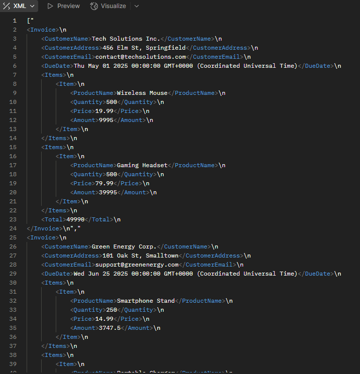
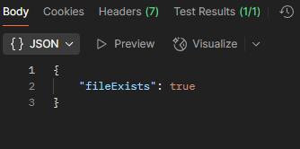
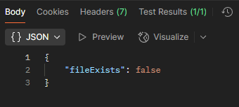

# Invoice Generation Project

## Project Overview
The goal of this project was to implement an integration for generating invoice files in both XML and PDF formats for customers, using data stored in a relational database. The generated invoice files were uploaded to an Azure Blob Storage container.

### Key Requirements:
- **Data Source:**
  - `customers`
  - `products`
  - `orders`
  - `orderLines`

- **Output Files:**
  - **XML Files** 
  - **PDF Files** 
  - All files (except some test files, oops :D) are named in the format `Roni_Akiola_[CustomerName]_invoice.xml`.

- **Azure Blob Storage:** The generated files were to be uploaded to a Blob Storage container named by my name.

## Tasks:
#### 1. **Data Mapping and Retrieval:** :heavy_check_mark:
   - Successfully retrieved data from the database using NestJS with TypeORM.
   - Mapped the data from the database into the required structure.

#### 2. **XML File Generation:** :heavy_check_mark:
   - Used the `fast-xml-parser` library to build XML files.
   - For each customer, an XML invoice file was generated containing their details (name, address, email, due date, order's product information, and total amount).
   - The XML files were formatted and uploaded to the Azure Blob Storage container.

#### 3. **PDF File Generation:** :heavy_exclamation_mark:
   - PDF file generation was tried briefly but time limit was already exceeded so efforts to make it work were discontinued (for not...).

#### 4. **File Upload to Azure Blob Storage:** :heavy_check_mark:
   - The generated XML files were uploaded to the Azure Blob Storage container using the `@azure/storage-blob` SDK.
   - The file names followed the specified format and were stored successfully in the container.
   - :heavy_exclamation_mark: This still needs practise since it's completely new tech for me. Not understanding much yet. :heavy_exclamation_mark:

#### 5. **Testing and Integration:** :heavy_check_mark:
   - Brute testing inside ethe application was done to check if the files were added into the Blob Storage.
   - There is no complete certainty if the test is working correctly
   - Needs actual tests :heavy_exclamation_mark:
   - Documentation was made of process

## What Was Learned:
1. **XML and PDF Generation:**
   - Learned how to generate XML files programmatically using `fast-xml-parser`, which simplified the process of converting the data into a structured format.
   - Explored various libraries for PDF generation so it's easier to begin now 

2. **Azure Blob Storage Integration:**
   - Gained hands-on experience with the `@azure/storage-blob` SDK for uploading and retrieving files from Azure Blob Storage.

3. **TypeORM for Database Queries:**
   - Using TypeORM to fetch relational data and map it to the invoice structure allowed us to efficiently query the database and handle related entities (e.g., customers, orders, products).

4. **Challenges with Formatting:**
   - The formatting of the XML files, especially with large datasets, required careful attention to ensure readability and correctness.

## Questions/Next Steps:

1. **Generating PDFs:**
   - What does this take to program well and effortlessly? How to do the layouts? How to structure the data on the file?

2. **Error Handling:**
   - What additional logging and error handling mechanisms should be implement for better debugging and tracking in production environments?

3. **Automated File Generation:**
   - Is it possible to automate the invoice generation and upload process to run monthly (as per the invoicing schedule), or should it be triggered manually?

## How to run

- :exclamation: Note: This program wont work after a while! :exclamation:

### 1. Clone the Repository
```bash
git clone https://github.com/roniakiola/invoice-app.git
cd invoice-app
```

### 2. Docker Compose
```bash
docker-compose -f docker-compose.dev.yml up --build
```

### 3. Test with Postman or any other program to test API-endpoints
Generate XML-files:
```bash
GET http://localhost:3001/invoice/generate
```
It will generate the XML-files and give you all the XML files in HTTP-response (It's a big messily structured right now but it has all the data).



Check if files exist:
```bash
GET http://localhost:3001/invoice/file/Roni_Akiola_Innovative Widgets Co.invoice.xml

GET http://localhost:3001/invoice/file/Roni_Akiola_Green Energy Corp.invoice.xml

GET http://localhost:3001/invoice/file/Roni_Akiola_Tech Solutions Inc.invoice.xml
```


## Conclusion:
This project provided valuable insights into integrating multiple technologies (database, XML, PDF, and cloud storage) to fulfill business requirements. The majority of the core functionality has been implemented successfully, but there are a few tasks such as PDF layout customization and testing that require further attention. These tasks, along with any additional features, can be addressed in the next phase of the project. But for a small spurt, it was was a great lessons.

Sorry about sending this late :sob:
